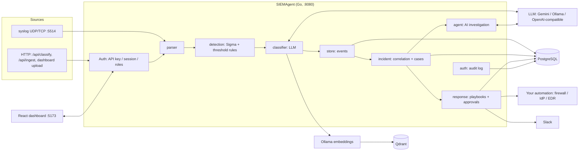
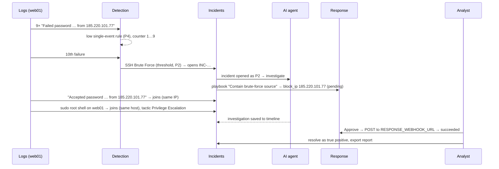

# Architecture: from log line to resolved incident

SIEMAgent is one Go service (API, detection, correlation, AI agent, response)
with a React dashboard, backed by PostgreSQL, Qdrant and an LLM. This page
follows a log line through the whole platform.

```
Ingest  →  Parse  →  Detect  →  Classify  →  Store  →  Correlate  →  Investigate  →  Respond  →  Report
```

## Components



| Package | Responsibility |
|---|---|
| `internal/ingest` | Syslog UDP/TCP listener; sheds load instead of blocking senders |
| `internal/parser` | RFC 5424, RFC 3164 (with or without `<PRI>`), rsyslog ISO timestamps, JSON, raw fallback |
| `internal/normalize` | Common field schema (ECS subset) filled from JSON keys and text formats |
| `internal/detection` | Sigma rules (single-event and `count()` thresholds), entity extraction (`src_ip`, `user`, `dst_port`), rule verdicts |
| `internal/classifier` | LLM classification with MITRE mapping; embeds events into Qdrant |
| `internal/store` | Event history and rule on/off state (Postgres or memory) |
| `internal/ioc` | IOC watchlists (feeds, files, manual lists) and matching |
| `internal/incident` | Correlation into incidents, case management, reports, AI briefs |
| `internal/agent` | Tool-calling investigation loop (AbuseIPDB, OTX, MITRE, similar events) |
| `internal/response` | Playbooks, proposed actions, approvals, webhook/Slack executor |
| `internal/auth` | Users, roles, sessions, audit log |
| `internal/api` | HTTP routes, middleware (auth, roles, CSRF, audit, rate limit), WebSocket hub |
| `web/` | Dashboard: Events, Incidents, Response, Analytics, Rules, Users, Audit, Docs |

## The flow, step by step

### 1. Ingest

Logs arrive three ways, all ending in the same `record()` path:

- **Syslog** (`SYSLOG_UDP_ADDR` / `SYSLOG_TCP_ADDR`): lines are queued to the
  worker pool. When the queue is full, lines are dropped and counted
  (`ingest_dropped_total`), so a slow LLM never stalls senders.
- **HTTP**: `POST /api/classify` (one line, also as SSE stream) and
  `POST /api/ingest` (up to 500 lines; the dashboard's **Upload** uses it).
- Every HTTP call first passes **authentication** (API key, session cookie, or
  open dev mode) and the **role check** (viewer, analyst or admin).

### 2. Parse

`parser` turns the line into a `LogEvent`: timestamp, hostname, app, PID,
message and source format. A line no format matches is kept as `raw`.
`normalize` then fills the event's `fields` with common names (`source.ip`,
`user.name`, `event.outcome`, …) from JSON keys and known text formats, so
rules and correlation work the same for every source. See
[FIELDS.md](FIELDS.md).

### 3. Detect (rules first)

`detection` evaluates every enabled Sigma rule:

- **Single-event rules** match one line (e.g. *Shadow Copies Deleted*).
- **Threshold rules** count matches per group over a window (e.g. 10
  `Failed password` from one `src_ip` in 5 minutes → *SSH Brute Force*) and
  fire on the event that crosses the threshold.

With `DETECTION_MODE=rules-first` (default), a rule match **is** the verdict:
severity from the rule level, MITRE from its tags, no LLM call. See
[DETECTION.md](DETECTION.md).

### 4. Classify (AI for the rest)

Events no rule matched go to the LLM, which returns attack type, MITRE
tactic/technique, severity P1–P5, confidence, IOCs and remediation. If the
LLM fails on an event a rule matched, the rule verdict is used, so an outage
never drops a known attack. Each event is also embedded (Ollama) and indexed
in Qdrant for similarity search.

### 5. Store

The classified event is saved (Postgres `events`, or memory) and shown in the
dashboard's **Events** list and **Analytics**.

### 5b. Match watchlists

Every event is checked against the enabled IOC watchlists (threat feeds, list
files, analyst lists). A match adds a detection and can raise the severity,
so known-bad infrastructure alerts even when no rule or model flags it. See
[WATCHLISTS.md](WATCHLISTS.md).

### 6. Correlate into incidents

An event an analyst has **suppressed** (by entity, rule or attack type) stops
here: it is stored, marked `suppressed_by`, but opens no incident.

Alerts at or above `INCIDENT_MIN_SEVERITY` (default P3) join an **open
incident** that shares an IP, user or host and was active within
`INCIDENT_WINDOW` (default 1h); otherwise a new incident opens. The incident
keeps its worst severity, the ATT&CK tactics reached (kill chain), entities
and a full history. See [INCIDENTS.md](INCIDENTS.md).

### 7. Investigate (AI agent)

When an incident **opens as, or escalates to, P1/P2**, the agent investigates
the **whole incident** (alerts numbered A1…An, entities, analyst notes),
calls threat-intel tools, and writes a cited report: executive summary,
timeline, impact, root cause, recommended actions, evidence. Progress streams
live over `/ws/alerts`; the write-up is saved to the incident timeline.
Analysts can re-run it (**Investigate with AI**) and rate it.

### 8. Respond (with approval)

Playbooks whose trigger matches the incident propose actions:
`block_ip`, `disable_user`, `isolate_host`, `notify`, `webhook`. By default
each waits for an analyst to **approve** it on the **Response** page or in the
incident; `dry_run` playbooks only record what they would do. Approved
containment is POSTed to `RESPONSE_WEBHOOK_URL` (your automation talks to the
firewall/IdP/EDR); notifications go to Slack. Private IPs and built-in
accounts are never targeted. See [RESPONSE.md](RESPONSE.md).

### 9. Close and report

Analysts set status, assignee and resolution, add comments, and export a
Markdown **incident report** (case facts, AI investigation, kill chain,
alerts, history). Every change is in the incident timeline and the global
**audit log**. See [USERS.md](USERS.md).

## One attack, end to end

The file [`siemagent/demo/attack-scenario.log`](../siemagent/demo/attack-scenario.log)
replays this story (see [TESTING.md](TESTING.md)):



## Data stores

| Store | Holds | Without it |
|---|---|---|
| PostgreSQL | events, rule states, incidents (+ entities, alerts, activity), response actions, users, sessions, audit log | everything in memory, lost on restart |
| Qdrant | event embeddings (`siem_events`, 768-dim) | semantic search and the agent's similar-events tool are off |
| Ollama | embeddings (`nomic-embed-text`); optional local chat LLM | no embeddings |

The schema is versioned: numbered SQL migrations in
`internal/migrate/migrations/` run once each, in a transaction, recorded in
`schema_migrations` with a checksum. The server applies pending ones on start
(an advisory lock serialises replicas); `siemagent --migrate` applies them as a
separate deploy step. A database migrated by a newer release is refused rather
than run by an older binary.

**Retention**: `RETENTION_EVENTS_DAYS`, `RETENTION_INCIDENTS_DAYS` and
`RETENTION_AUDIT_DAYS` bound how long events, resolved incidents (with their
alerts, history and response actions) and audit entries are kept. The purge
runs hourly in batches; open incidents are never purged and expired login
sessions always are. The default keeps everything. Admins see the policy and
the last run on the **Audit** page (`GET /api/retention`).

## Security boundaries

- **Authentication**: API keys (admin service accounts, constant-time HMAC
  comparison), bcrypt user accounts with hashed session tokens, lockout after
  5 failures. Open mode only when nothing is configured.
- **Authorization**: viewer reads, analyst works incidents and approves
  actions, admin manages rules, users and the audit log.
- **CSRF**: cookie writes need `X-Requested-With`; cookies are
  `SameSite=Strict`.
- **Untrusted log text**: control characters are stripped before logging
  (`internal/logsafe`) and in API responses; reports escape HTML/links/images;
  the AI prompt fences log text off as evidence (prompt-injection defence).
- **Response safety**: human approval by default, no private-IP blocks, no
  built-in account disables, webhook URLs never returned or stored.

## Observability

`/metrics` (Prometheus) exposes classification, detection, incident,
response, auth and ingest counters; `/health` and `/health/ready` for
probes; `/docs` serves the OpenAPI reference.
